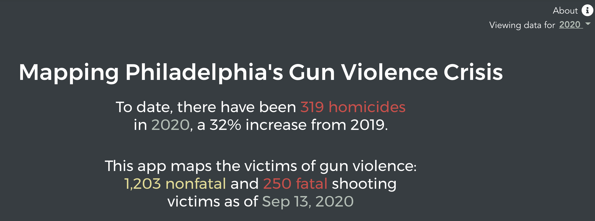
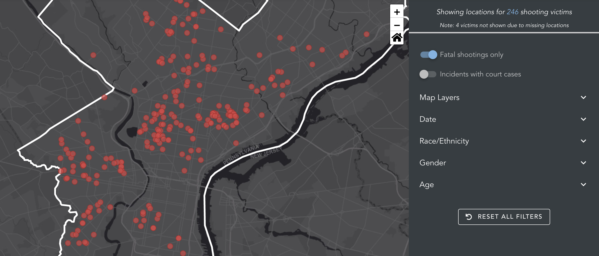
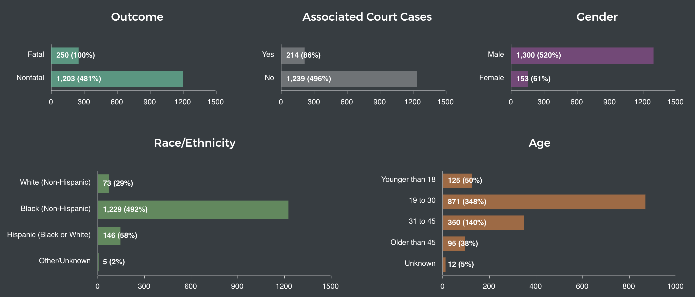

# Mapping Philadelphia's Gun Violence Crisis

The code behind the interactive map of Philadelphia's gun violence crisis. 

The interactive visualization is available [here](https://controller.phila.gov/philadelphia-audits/mapping-gun-violence/#/).
For more information, see the application's [About Page](https://controller.phila.gov/philadelphia-audits/mapping-gun-violence/#/about).





## Data

The application relies on a number of publicly available data sources, including: 

- [Data for shooting victims](https://www.opendataphilly.org/dataset/shooting-victims) from the City of Philadelphia's open data portal;
- [Philadelphia's total homicide count](https://www.phillypolice.com/crime-maps-stats/) from the Philadelphia Police Department's crime statistics website, and;
- [Information on court cases associated with shooting incidents](https://ujsportal.pacourts.us/DocketSheets/MC.aspx) compiled from the web portal for Pennsylvania's Unified Judicial System.

For the software and data behind the analysis for this dashboard, see the companion repository [PhiladelphiaController/gun-violence-dashboard-data](https://github.com/PhiladelphiaController/gun-violence-dashboard-data).

## Tools

The application is built using a combination of open-source tools, including:

- [vue](https://github.com/vuejs/vue);
- [leaflet](https://github.com/Leaflet/Leaflet) and [esri-leaflet](https://github.com/Esri/esri-leaflet);
- [vue-apexcharts](https://github.com/apexcharts/vue-apexcharts), and;
- [crossfilter](https://github.com/crossfilter/crossfilter).

## Development

### Project setup
```
npm install
```

### Compiles and hot-reloads for development
```
npm run serve
```

### Compiles and minifies for production
```
npm run build
```

